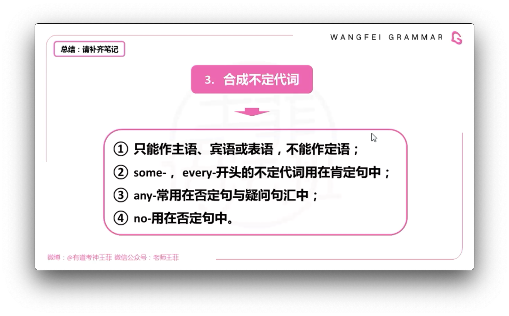
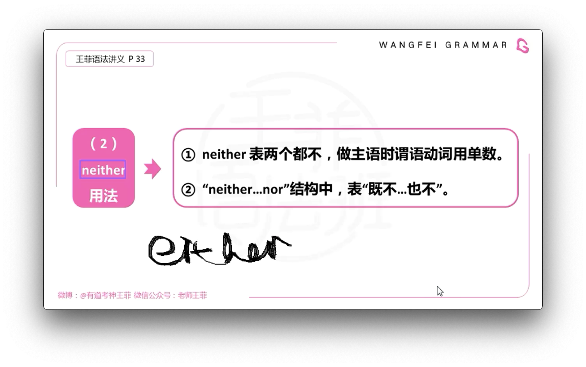

# 代词

## 指示代词:  this, that, these, those

that/those 代替前边提到过的人或物.

this/these 代替下文将要提到的人或物.

打电话介绍自己时用 this 指 "我". that 指对方.

## 关系代词:

- 用来引导定语从句
- 充当成分
- 有主, 宾, 属格
- 有人, 物之分

## 连接代词

## 不定代词

few/little 有a肯, 没a否, 小样的不可数.

## 否定代词

