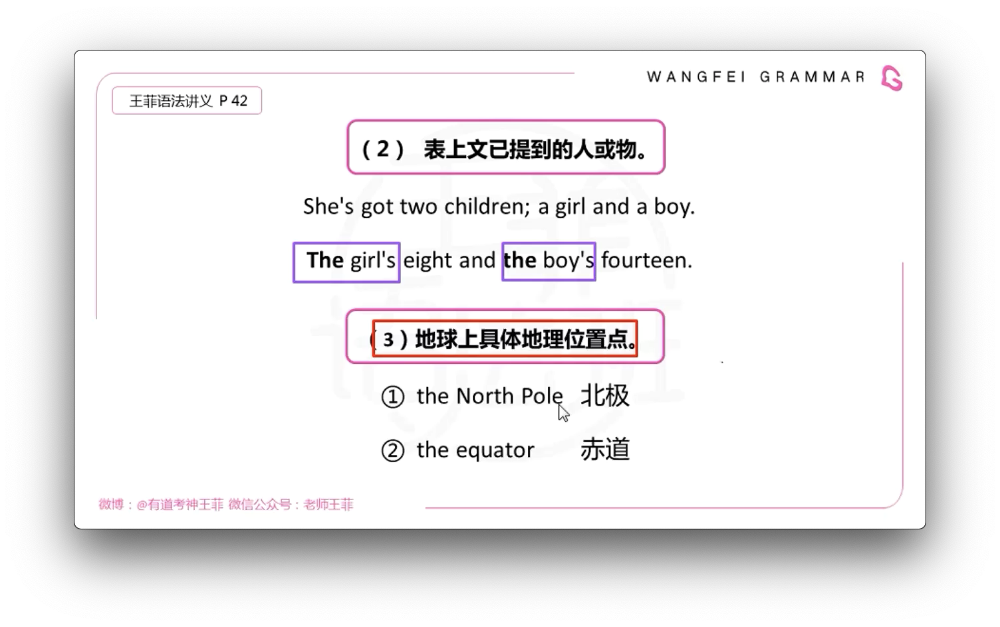
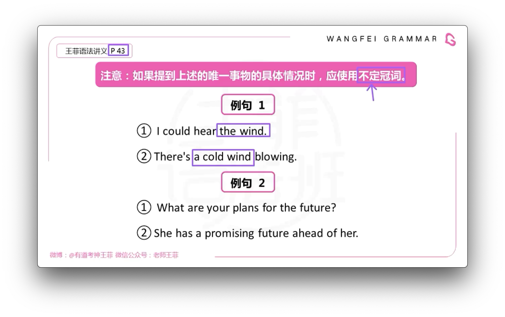
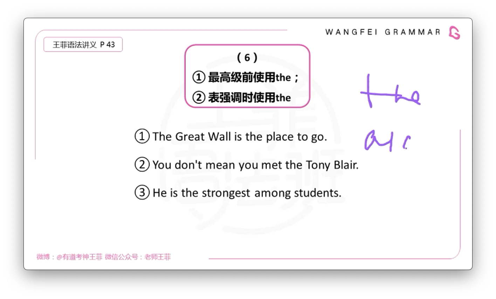
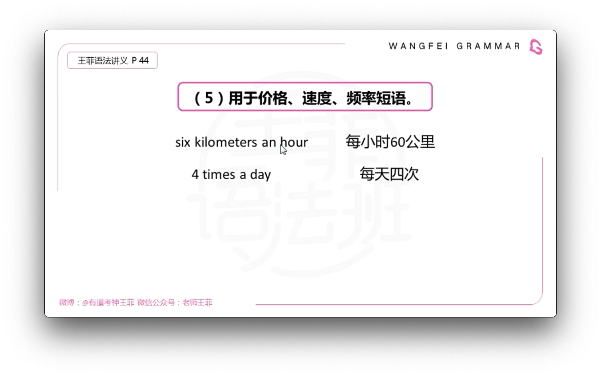
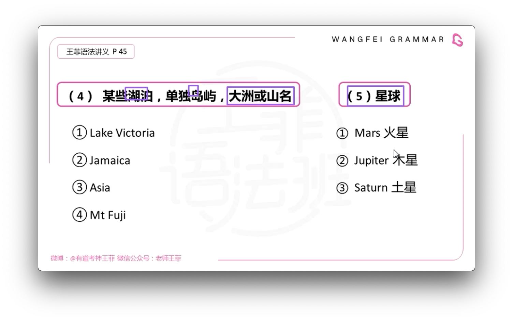
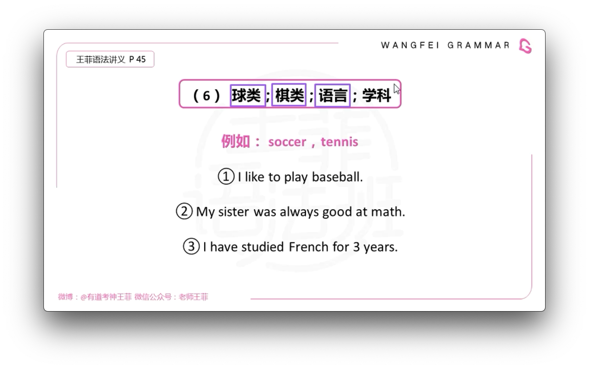
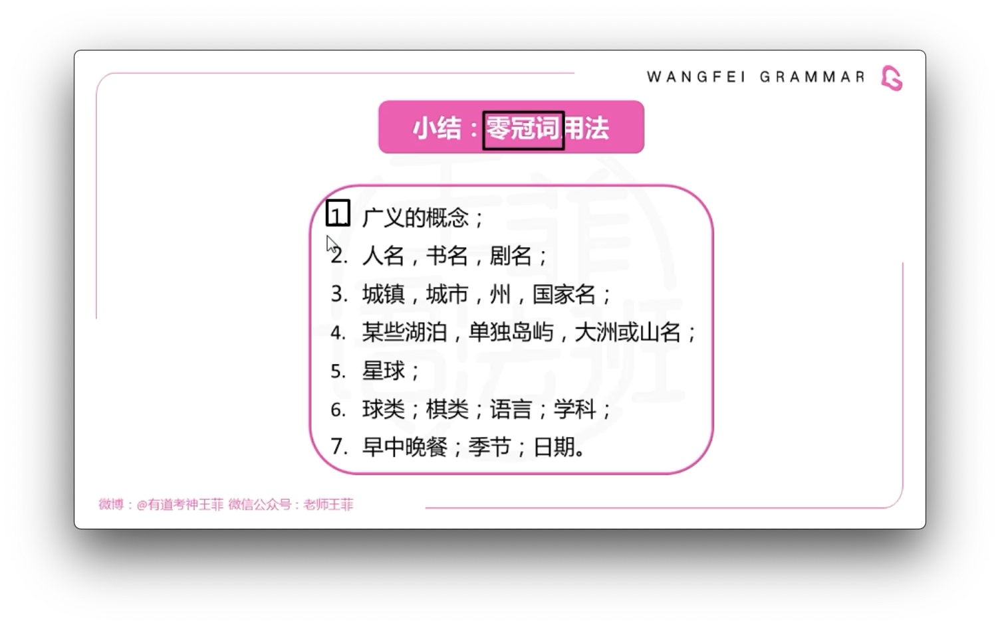
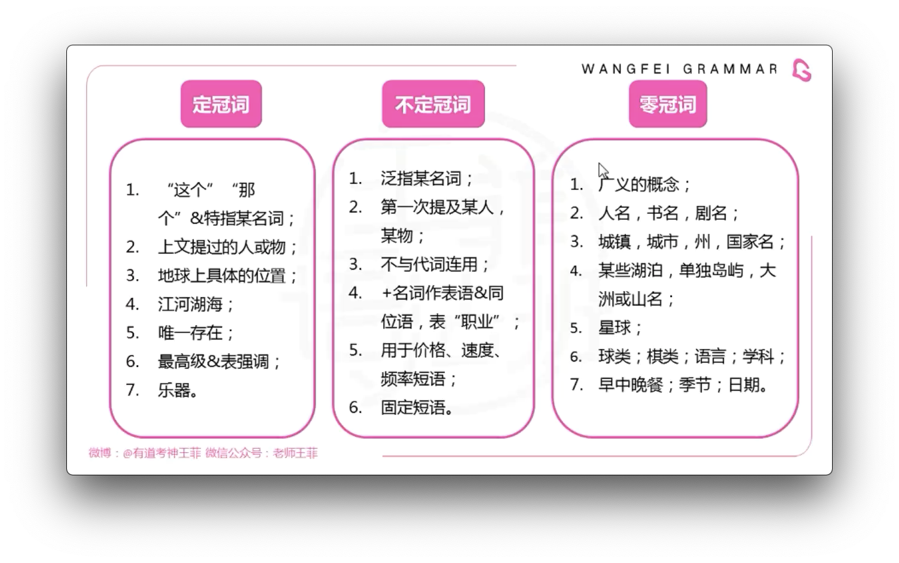

# 冠词

## 不定冠词

 

## 零冠词

# 冠词

|      | 可数         | 不可数    |
| ---- | ------------ | --------- |
| 泛指 | a dog/dogs   | Water     |
| 特指 | the dog/dogs | the water |

# 細節: 基本要理解语意, 准确翻译才好做对.

- a adj. 不可数名词, 这个时候是具体的事物, a heavy rain.

- success, failure, pleasure, drink, comfort 在语境中只具体的事物(理解为`成功, 愉快的事`), 则认为可数.
- `序数词`second 做`额外`理解时, 用 a.
- Most 有`非常,很`的意思. 不一定用 the
- the blue whale, 表物种.
- 平行重述, 先用 the, 后用 a.

