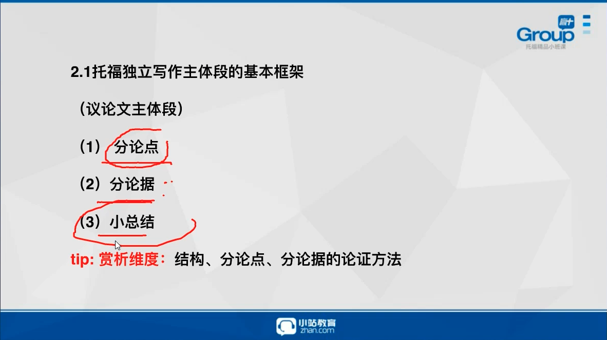

1. 态度: 同意与否; 
2. 写作结构: 让步-反驳-反驳; **只有横向对比的题目才可以用中立.**
3. 每个主体段分论点 + 分论据简单提示
   1. 让步: 有时薪资确实重要
   2. 反驳: 有时工作地点比薪资重要.
   3. 反驳: 有时晋升空间比薪资重要.

# 格式

- 顶格
- 空一行
- 标点后空一格
- 不可以缩写, cannot

# 陷阱

1. 注意题目`限定词`.

# 满分开头

1. 选出`核心名词`. (在题目抽象出topic, 先写一句关于其重要性, 事实. 然后把题目当做结果, 思考原因法.)
2. `引入题目`. (用自己的表达叙述题目一遍, 要全面.)
3. 给出自己观点.

# 黑五类

.png)

- 反驳一定要和题目的点作对比.
- `分论点`要和`题目`有明确关系, 要有好坏(要有观点, 不能只是fact, 要有opinion).对观点具体化("分类讨论"), 就有更多内容可以写.
- 487855

==

您好！订单1612125181335423144
卡号：ediehomgmw77@gmail.com 	resdx2q45	EdieHomgmwtus@outlook.com.us	(918) 888-6584
因新IP登陆最好第二天改密码，（必须改密码），发货格式：邮箱----密码----辅助邮箱----电话！ 美国区号+1
外国固定IP登陆网页邮箱接美国短信！ 最好第二天固定iP登陆改辅助邮箱（原辅助邮箱乱填的）
各种教程网址链接:    http://www.googlegv.cn

==